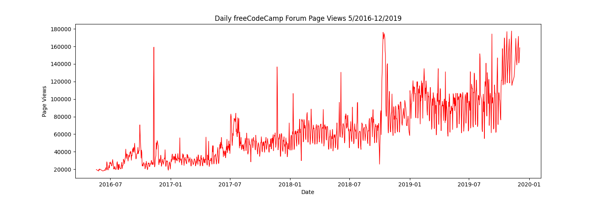
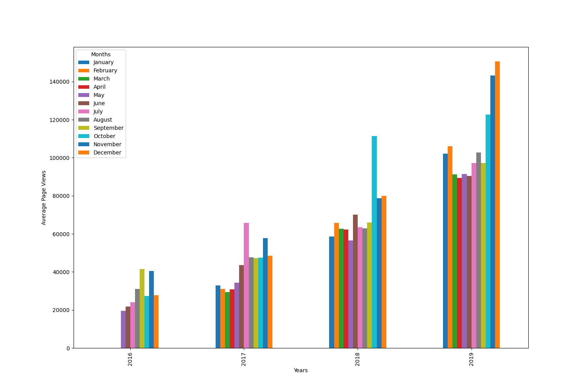
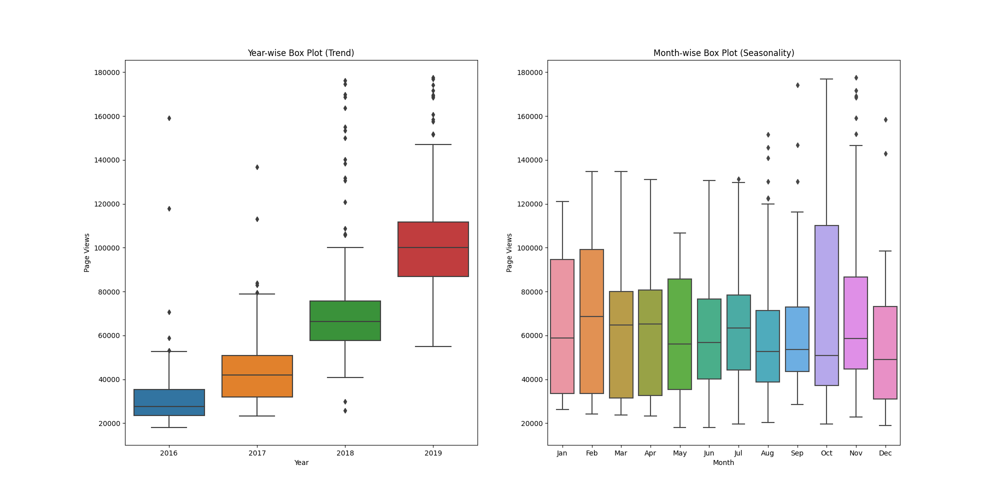

# Page View Time Series Visualizer

This project involves visualizing and analyzing time series data of page views on the freeCodeCamp.org forum from 2016 to 2019. The primary goal is to understand patterns, trends, and seasonality in the data. This was completed as a requirement for the freeCodeCamp "Data Analysis with Python" certification.

## Visualizations

### Line Plot: Daily Page Views

### Bar Plot: Average Monthly Page Views by Year

### Box Plots: Trend and Seasonality

## Key Tasks Performed

- **Data Cleaning:** Filtered out outlier days where page views were in the top or bottom 2.5% of the dataset.
- **Line Chart:** Visualized the entire dataset to show daily page views over time.
- **Bar Chart:** Showed the average daily page views for each month, grouped by year, to highlight yearly growth.
- **Box Plots:** Created year-wise and month-wise box plots to demonstrate long-term trends and monthly seasonality.

## Technologies Used

- **Python**
- **Pandas:** For data loading, cleaning, and manipulation.
- **Matplotlib:** For creating the plots and customizing labels.
- **Seaborn:** For creating the detailed box plots.

---
*This is one of five projects required to earn the freeCodeCamp Data Analysis with Python certification. You can view my certificate [here](https://www.freecodecamp.org/certification/angel_mainali/data-analysis-with-python-v7).*
